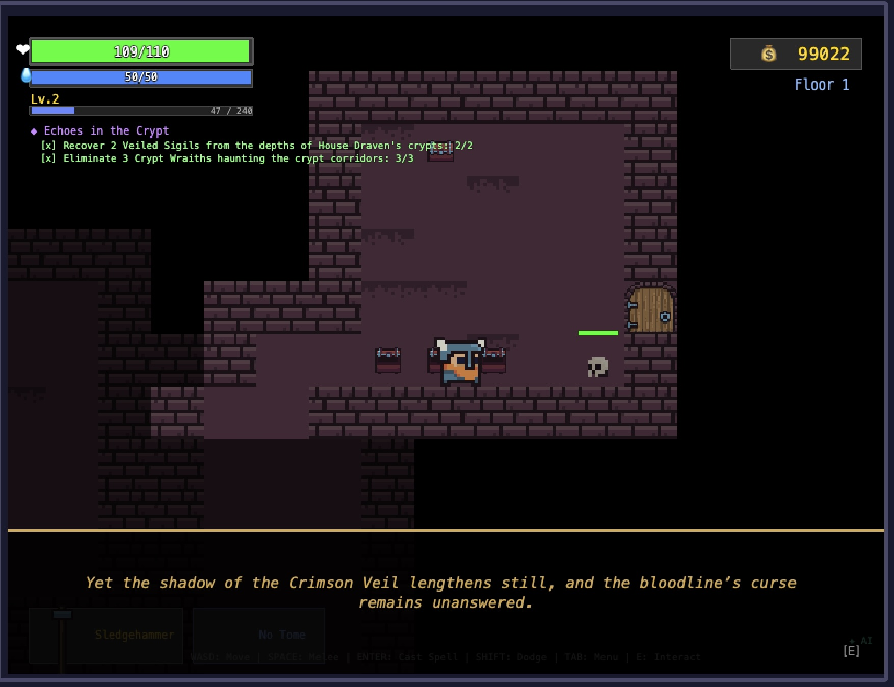
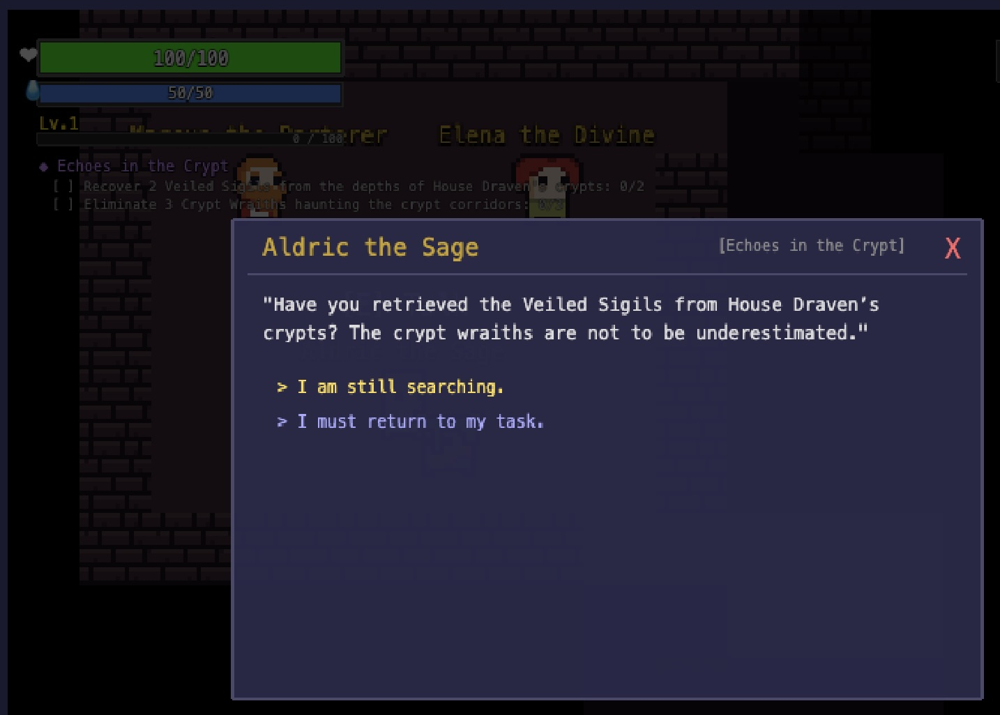
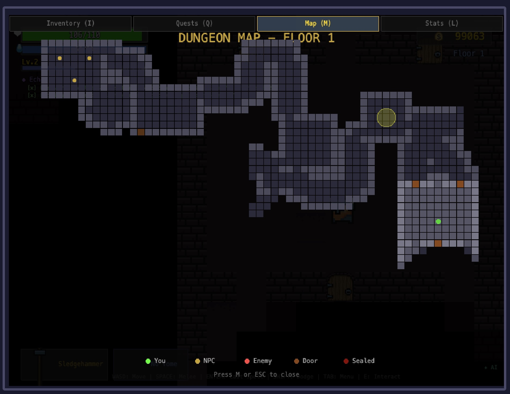
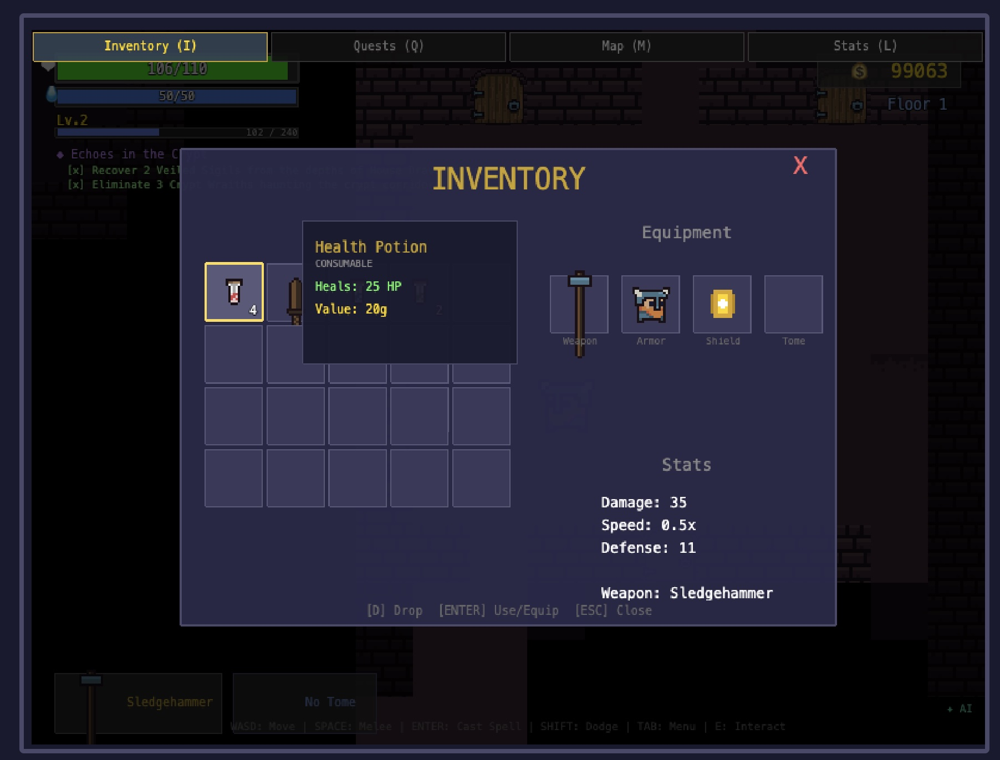

# Dungeon Weaver

A top-down dungeon crawler where an LLM weaves the quests, lore, and story arcs in real time.

Built with Phaser 3, TypeScript, and an Express backend that talks to any OpenAI-compatible API. The game works fine offline with hardcoded quests, but plug in an LLM and it starts generating coherent multi-quest story arcs, custom monsters, variant items, and cinematic narration on the fly.



## Why this exists

I grew up on retro RPGs and dungeon crawlers, and I wanted to experiment with how LLMs could make that kind of game less predictable. The main question I'm exploring: can AI-generated quests and story arcs actually improve replay value, or does it just feel random? I'm not a game dev or an artist (you'll notice the entire project leans on 0x72's pixel art), but Phaser 3 was the simplest entry point to get something playable. The quest generation pipeline uses several agentic AI patterns:

- **Prompt Chaining** - Arc outline feeds into lore fragment, which feeds into quest generation. Each step grounds the next, so a quest about the "Shard of Valdris" actually references the lore's fallen kingdom of Valdris.
- **Evaluator-Optimizer** - A second LLM call scores generated quests on 5 narrative dimensions (arc coherence, lore integration, continuity, NPC voice, dialog specificity). If it scores below threshold, critique gets fed back and the quest regenerates.
- **Model Routing** - Boss quests and arc-critical content go to the capable model. Pool fillers and evaluator calls go to the fast/cheap model. Saves cost without sacrificing quality where it counts.
- **Parallelization** - Independent LLM calls (pool warmup, intro narration + first quest) run concurrently.
- **Orchestrator-Workers** - Floor content planning with thematic room generation (not yet implemented).

Each pattern has a feature flag in `server/game.config.json` so you can toggle them independently.



## The game itself

Procedurally generated BSP dungeons (via rot.js), 3 floors per run, multiple monster families, boss fights, fog of war, shops, inventory, equipment, spells, dodge rolling, combo attacks, charged attacks.

**Controls:**
| Key | Action |
|-----|--------|
| WASD / Arrows | Move |
| SPACE | Attack (tap or hold to charge) |
| ENTER | Cast spell |
| SHIFT | Dodge roll |
| E | Interact / open chests |
| I | Inventory |
| Q | Quest log |
| M | Dungeon map |
| L | Stats / level up |
| TAB | Cycle between overlays |

Gamepad works too (A=attack, B=dodge, X=interact, Y=inventory).

 

## Running it

```bash
npm install
npm run dev
```

Frontend on `localhost:4200`, backend on `localhost:4201`. Vite proxies `/api` calls to the backend.

### With LLM

Copy `server/.env.example` to `server/.env` and set:

```env
LLM_ENABLED=true
LLM_API_KEY=your-key
LLM_BASE_URL=https://api.openai.com/v1  # or any compatible endpoint
LLM_MODEL=gpt-4.1-mini
LLM_MODEL_FAST=gpt-4.1-nano
```

Both `LLM_ENABLED=true` and `LLM_API_KEY` must be present. Missing either and the game falls back to hardcoded quests silently.

### Without LLM

Just run it. No config needed. You get the full game with a set of built-in quests instead of generated ones.

## Tech stack

| Layer | Tech |
|-------|------|
| Game engine | Phaser 3.80+ |
| Language | TypeScript |
| Build | Vite |
| Dungeon gen | rot.js (BSP Digger) |
| Backend | Express + better-sqlite3 |
| LLM | OpenAI SDK (any compatible provider) |
| Logging | pino + pino-pretty |
| Assets | 0x72 DungeonTileset (16x16 pixel art) |

## Deploying

Deployed as a single Render web service. There's a `render.yaml` blueprint. Push to GitHub, connect in Render, set `LLM_API_KEY` in the dashboard. SQLite persists on a Render disk at `/data/game.db`.

```bash
npm run build   # Vite build + server deps
npm start       # Express serves frontend + API
```

## Project structure

```
src/                          # Phaser client
  scenes/                     # Boot, Menu, Game, UI, Inventory, Shop, etc.
  entities/                   # Player, Monster, NPC
  systems/                    # Combat, Quest, FogOfWar, DungeonGenerator, etc.
  data/                       # Item/monster/NPC definitions
  services/ApiClient.ts       # REST client

server/                       # Express backend
  src/
    routes/                   # /api/saves, /api/quests
    services/                 # LLM, story arcs, quest pools, prompt templates
    db/                       # SQLite setup
  game.config.json            # Story arc + AI pattern settings
```

See [ARCHITECTURE.md](ARCHITECTURE.md) for the full system diagram and LLM flow, [GAME_DESIGN.md](GAME_DESIGN.md) for mechanics and balance, and [PRD.md](PRD.md) for the feature roadmap.

## Status

Three AI patterns are implemented (prompt chaining, evaluator-optimizer, model routing). Parallelization and orchestrator-workers are designed but not yet wired up. See the PRD for what's next.

## Assets

Tileset assets came from [0x72's 16x16 DungeonTileset](https://0x72.itch.io/16x16-dungeon-tileset).
